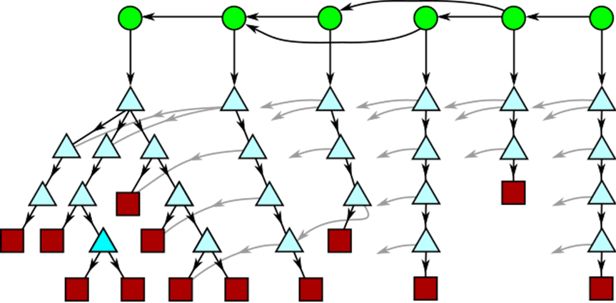
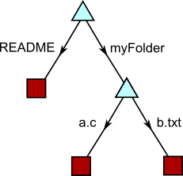
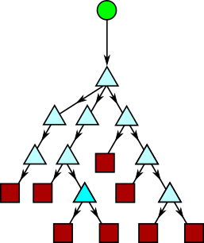
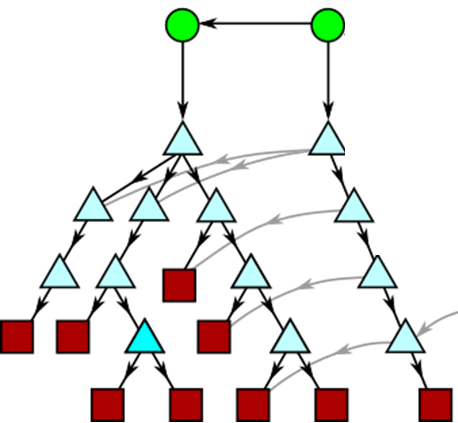
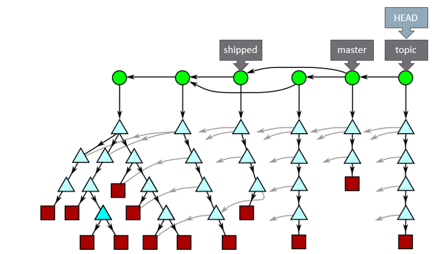
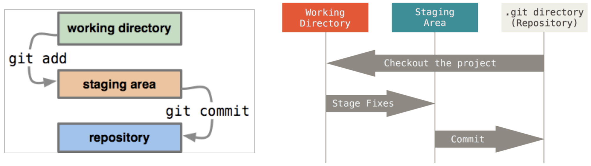

# Git


### Why Version Control?

> You're working on a team project and need to make edits to reports and code. You waiting for your team member to make a change and then email you back another a copy. There has to be a better way...

"Version control is the lab notebook of the digital world: it’s what professionals use to keep track of what they’ve done and to collaborate with other people. Every large software development project relies on it, and most programmers use it for their small jobs as well. And it isn’t just for software: books, papers, small data sets, and anything that changes over time or needs to be shared can and should be stored in a version control system." -- [Version Control with Git](http://swcarpentry.github.io/git-novice/)


## Understanding Git

What better way to understand git, then check out git itself. This might take a while...

```bash|{type:'command', stream: true, failed_when:'exitCode != 0'}
git clone https://github.com/git/git
```

We'll be working inside the git/ directory set our working state to v2.23.0.

```bash|{type:'command'}
cd git
git reset --hard v2.23.0
```

### Git's Object Model: Content-Addressable Data Store.



* Every object has a SHA-1 hash: 40 hex characters.
* Given 40 hex characters, we can find the unique object with that hash.

Let's examine a single commit.

```bash|{type:'command', path: 'git', highlight: {word: '5fa0f5238b0cd46cfe7f6fa76c3f526ea98148d9', title:'This 40 hex id allows us to find this object inside the git object store.'}}
git log -1 --abbrev=40
```

### Object Types: Blobs, Trees, Commits

We will use the `git cat-file` command to help us search for objects inside the store.
If we provide git with a partial hash, it will attempt to find a unique match, and if it is unable to, it will provide a list of those that did match.

```bash|{type:'command', path: 'git', block: {word: 'commit', title:'There are actually several types of objects in the data-store. For example, a tree object contains folder contents.', rows: 5}}
git cat-file -p 5fa0
```

#### Blobs

Let's examine a **blob** object. A blob contains _file contents_. 


```bash|{type:'command', path: 'git', highlight: {word: "Here are the topics that have been cooking", title:"Note: the file name is not part of the object! It is just the text or binary contents."}}
git cat-file -p 5fa073a885
```

#### Trees

Let's examine a **tree** object. A tree contains _folder contents_. 


```bash|{type:'command', path: 'git', block: {word: 'CodingGuidelines', rows: 8, title: 'A tree can contain blobs and other trees. Notice that RelNotes is another tree with additional folder content.'}}
git cat-file -p 5fa02bff4e
```
Example representation of folder contents contained by a tree: 



#### Commits 

Perhaps one of the most important type of object inside the object model is a commit. A **commit** contains many things:

* A root **tree**
* A list of **parent commits**
* A commit message
* An author name, email, time.
* A committer name, email, time.




Let's examine an example commit.

```bash|{type:'command', path: 'git', highlight: {word: "committer", title: "A committer can differ from an author, for example, a committer may be merging a pull request from another author."}}
git cat-file -p 5fa00a4dcf
```

We can examine the commit graph (but only the first part!).

```bash|{type:'command', path: 'git', tty: true}
PAGER='head -n 80' git log --graph --oneline
```

#### Diffs

Diffs are not part of the object model!

> **Commits are NOT diffs**

Instead, diffs are dynamically calculated from the commit graph inside the object store. For example, even object attributes, such as _file renames_ are not represented inside the datastore and must be calculated dynamically.

Let's examine a diff.

```bash|{type:'command', path: 'git'}
git diff --raw v2.22.0 v2.23.0
```

#### Merkle Trees

To enable efficient representation and fast computations of git operations, _merkle trees_ provide forward references within the graph to blobs.



### Branches

_Branches_ are simply pointers to commits. _Tags_ are pointers to anything (commits, trees, blobs).



#### Move between branches with git switch

`git switch` is a new feature in v2.23.0 of git. It essentially replaces and does less work than `git checkout`. Primarily, `git switch` will:

* Change `HEAD` to point to a new branch.
* Updates the working directory to match the commit's tree.

We can switch our branch to the maintenance branch.
```bash|{type:'command', path: 'git'}
git switch maint
```

Let's confirm.

```bash|{type:'command', path: 'git'}
git status
```

We can return to the main branch.

```bash|{type:'command', path: 'git'}
git switch master
```

## Activity: Creating a Repo

Let's try the basics. A repository (repo) is where the backup (master) copies of all files are stored.
– **Local repository:** on your computer
– **Remote repository:** shared repository in the cloud

Let's create a new local git repository.

Create a new directory (Basics) and file (README.md).

```bash|{type:'file', path: 'Basics/README.md'}
# CS5704 SE Basics Workshop
Hello!
```

We are going to create a new git repository, but maybe not the way you've done it before. 
In the next set of commands, we will be working inside the `Basics/` directory.

This will create a new .git directory to store commits and other objects.

```bash|{type:'command'}
cd Basics
git init
```

We can quickly inspect the contents of the git's directory and object store.

```bash|{type:'command', path: 'Basics'}
ls -l .git
echo "objects:"
ls -l .git/objects
```

Before adding a file to the repository, it must first be staged.

```bash|{type:'command', path: 'Basics'}
git add README.md
```

We will commit our staged changes into the repository.

```bash|{type:'command', path: 'Basics'}
git commit -m "initial commit"
```

Nice work!

### Stage, unstage, and discard changes

Changes flow from our working tree, to staging index, and into repository.




## Activity 

Use the following sets of steps to bserve what happens to the _working tree_ and _index_, by running the `git status` command:

Update the README.md and stage our change.

```bash|{type:'command', path: 'Basics', shell: 'bash'}
echo " Update: $(date)" >> README.md
cat README.md
git add README.md
```

View the current state of our **working tree** and **index**.

```bash|{type:'command', path: 'Basics'}
git status
```

Unstage file (remove from index), but keep changes in working tree.

```bash|{type:'command', path: 'Basics'}
git restore --staged README.md
```

Discard changes in worktree (we will lose our work!). This will restore changes to both the index and the working tree based on the latest version in the repo.

```bash|{type:'command', path: 'Basics'}
git restore --source=HEAD --staged --worktree README.md
```

### Remotes

While having a local git repository is cool, we should connect it to another remote repository. In other words, **we have no place to `git push` to**...


#### Remote operations

* Get new data: `git fetch <remote> [branch]`
* Upload your data: `git push <remote> <branch>`
* Get new data and merge into working tree: `git pull <remote> <refspec>`


## Activity: Let's create a remote repo!

1. Create a new _private_ repository on GitHub (https://github.com account is needed). Name your repository Basics and set a description to be something about "CS5704 Software Engineering Basics Workshop". Skip the initialization steps and create your repo.

2. Follow the instructions to add a remote url to an existing git repository (**push an existing repository from the command line**). It should start with something like: `git remote add origin https://github.com/<user>/<repo>.git`

3. Push your changes to GitHub. Verify you can see your updated README.md!

4. On GitHub, edit the README.md (click on the pencil icon in the top right corner of the file) to say "Hello GitHub!". Commit the changes directly on GitHub. Now you have changes in your remote (origin), that are missing on your local copy.

5. Run `git pull` locally to verify you now have the updated changes.

```bash|{type:'command', path: 'Basics'}
git pull
```

6. Invite the instructor (chbrown13) and TA (TBD) to be collaborators to your repository (`Settings -> Manage access`).

This repository is where you will place all the materials from the workshop today. In the highest-level folder, upload your FizzBuzz program screenshot(s) and `workshop.sh` bash script files from the previous notebooks.


## Git Branching Playground

Manipulating the commit graph can get quite complicated! This interactive visualization is very useful for getting a deeper understanding of how operations such as branches, merges, cherry-picking, and more work!

We will solve the "Introduction Sequence" levels in:  
http://pcottle.github.io/learnGitBranching/   


