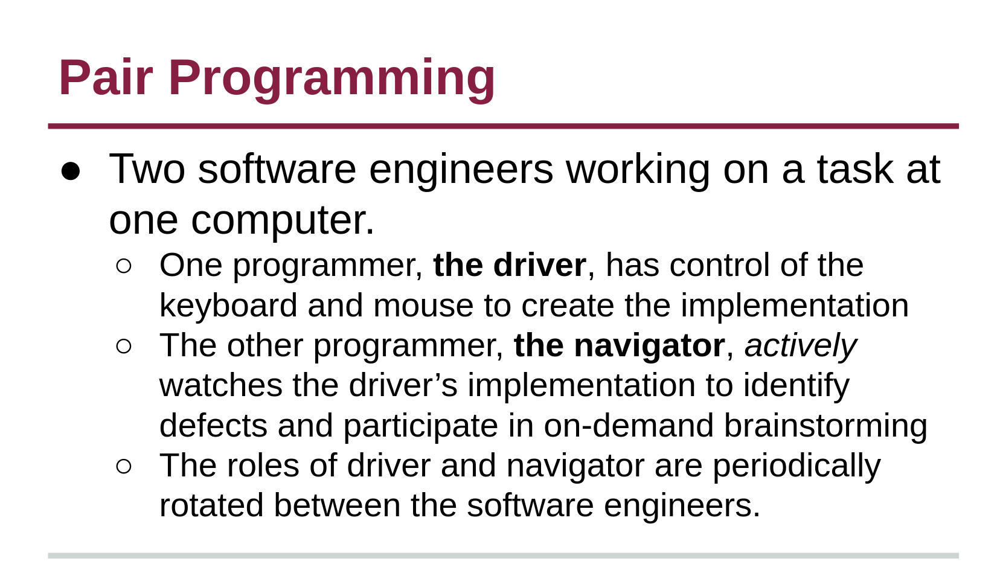

# Pair Programming

Pair programming is a common practice in development environments where two software engineers work on a programming task together at the same computer. Review the lecture slide below to review the software engineer roles while participating in this process.

## 📝 Activity

For the following activity, find a partner in class (or virtually if you are not in class) with shared knowledge of a programming language. Each student must complete a designated part of the program below _on their own machine_, while the partner **_actively_** participates in the coding.

> **Roman Numerals**
> 
> Roman numerals are depicted by using seven different symbols: `I, V, X, L, C, D and M` to represent seven different numerical values: `1, 5, 10, 50, 100, 500, 1000`. For this activity, one student will be the driver while the other navigates to write a function that converts an [integer to a Roman Numeral](https://leetcode.com/problems/integer-to-roman/). Then, students should switch roles to develop a function that converts [Roman numerals to integers](https://leetcode.com/problems/roman-to-integer/). The driver must complete their portion of the program on their own machine. You are not expected to come up with the most efficient solution---this is an activity to practice pair programming, not a job interview.

## [Branching ⏭️](Branches.md)